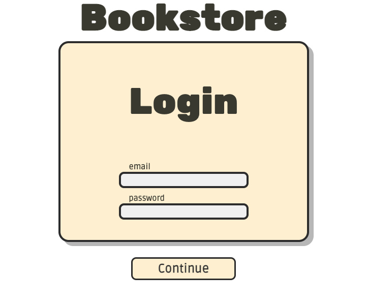

# COMP-3005 Project
**Michael Uzoegwu 101128175**

This is my submission for the COMP-3005 project, FALL 2021.

&nbsp;

## Instructions to run
_These instructions were tested on MacOS, but they should work on Windows or Linux_

&nbsp;

# Clone the repository:

```bash
git clone https://github.com/MichaelUz/web-app.git
```
Or download as zip from GitHub

&nbsp;

# Setup database

## Install PostgreSQL
You need to install PostgreSQL if you haven't already. Follow the steps [here](https://www.postgresql.org/download/) to download the correct version for your OS.

&nbsp;

More in depth:
- Windows: https://www.postgresqltutorial.com/install-postgresql/
- MacOS: https://www.postgresqltutorial.com/install-postgresql-macos/
- Linux: https://www.postgresqltutorial.com/install-postgresql-linux/

&nbsp;

## Seed Database
Open a terminal and navigate to the root directory of the project:

```bash
cd /your/path/to/root/web-app
```

If on **Mac OS** or linux, open the psql interactive terminal and then seed the database using the following commands. Make sure to use your own path to the project root directory.
```bash
psql
\i /your/path/to/root/web-app/src/sql/init.sql
```
On **Windows** open the "SQL Shell (psql)" application that should've come with your installation and type the following command:
```bash
\i 'C:/path/to/root/web-app/src/sql/init.sql'
```

If everything went right, you should see output similar to this:

```
You are now connected to database "postgres" as user "user".
DROP DATABASE
CREATE DATABASE
You are now connected to database "bookstore_101128175" as user "user".
CREATE TABLE
INSERT 0 3
CREATE TABLE
INSERT 0 4
CREATE TABLE
INSERT 0 8
CREATE TABLE
INSERT 0 7
```

Once done type ```\q``` and press enter to exit the psql interactive terminal.

&nbsp;

# Start the Server

## Enter your postgres details
Edit the ```postgres.json``` file in the root directory and enter the details of you postgres server.
>Note that you shouldn't change the "database" entry.
```json
{
    "user": "michaeluzoegwu",
    "host": "localhost",
    "database": "bookstore_101128175",
    "password": null,
    "port": 5432
}
```

&nbsp;

Ensure you have Node.js installed. You can install it here:
[Install Node.js](https://nodejs.org/en/)

```
----------------------------------------------------------------------------
|                                                                           |
|**IMPORTANT: FOLLOWING STEPS HAVE TO BE DONE AT ROOT DIRECTORY OF PROJECT**|
|                                                                           |
----------------------------------------------------------------------------
```

Ensure you're at the root of the project i.e:
```bash
/your/path/to/root/web-app
```
Run the following commands:
```bash
npm i
node js/server/app.js
```
You should see the following output:
```bash
Now listening on port 3000
```

&nbsp;

# Use Website
Open a web browser and navigate to [http://localhost:300](http://localhost:300)

You should see the login page


&nbsp;

# Note
[Typescript](https://www.typescriptlang.org/) was used to develop the project. The files sent to the fronted are in the
```js/``` folder. They are transpiled by typescript and are not not very readable. The typescript files are the written source code and are in the ```src/``` folder. 

The SQL queries used in the application are in the ```sql``` folder. Parameters were enclosed with angled brackets ```<>```.


